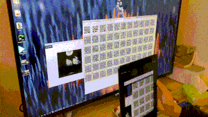

# qrtransfer

This is a proof-of-concept project, implemented in Rust WebAssembly.

## How to Use

1. Open [https://qrtransfer.westxu.com](https://westxu.github.io/qrtransfer/) on your PC, select file, zoom/adjust the browser window as you wish. Note that this site is static, which means the file will be processed natively in your browser and won't be uploaded to any server.
2. Open [https://qrtransfer.westxu.com](https://westxu.github.io/qrtransfer/) on your phone, scan using your camera while scrolling/auto-scrolling your browser until finishing scanning all qrcodes, and then save the reassembled file.

## Note

If your browser somehow couldn't access local files, try the [python branch of this repo](https://github.com/WestXu/qrtransfer/tree/python).

The suffix of the received file may not be correct. Fix it manually with file manager apps on your phone.

The transfer speed is ~1KB/s. I know, but it works.
